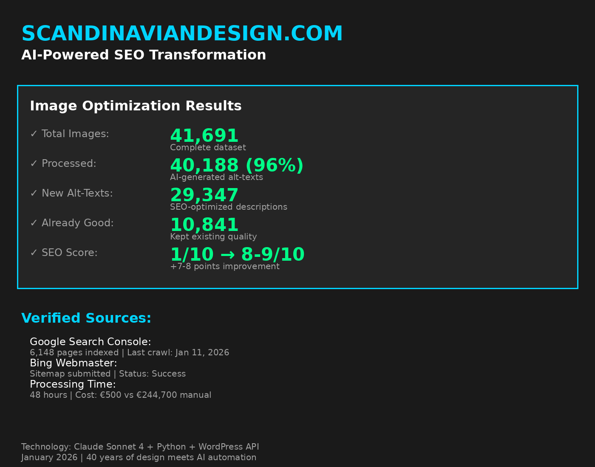
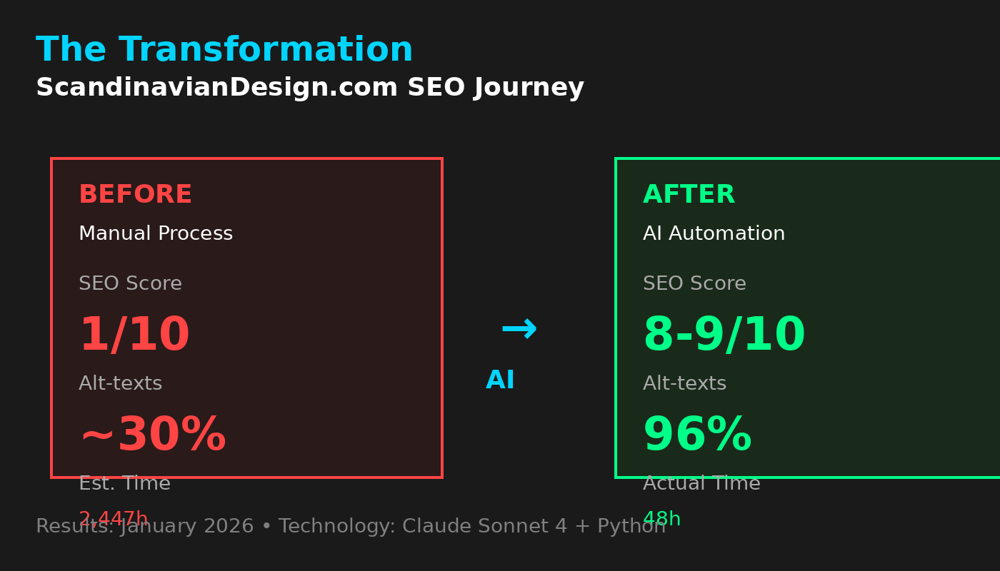
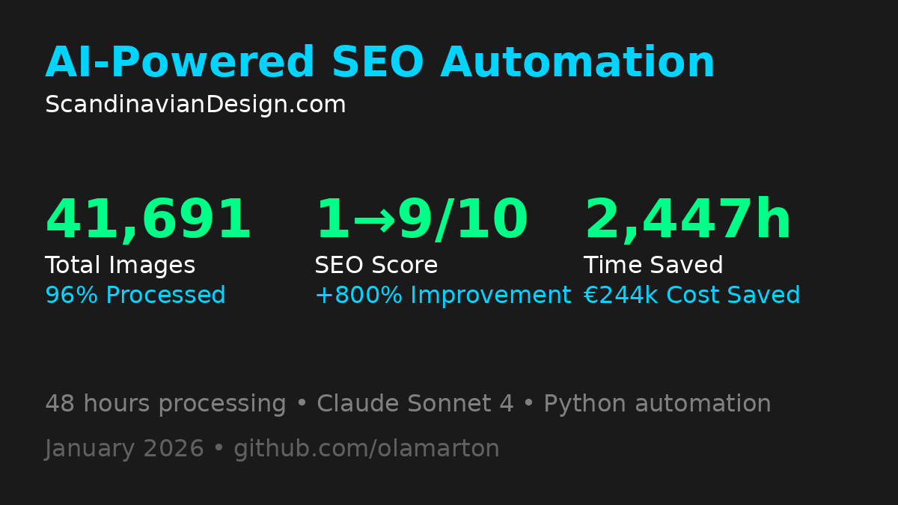

# ScandinavianDesign.com - AI-Powered SEO Automation



## 📊 The Challenge

**Legacy design news portal with 29 years of content:**
- 41,691 images uploaded since 1996
- Minimal alt-text coverage
- SEO score: 1/10
- Manual optimization = 2,700+ hours of work


*Visual transformation: From manual chaos to AI-powered efficiency*

**The math:** 
29,347 images × 5 min per image = 2,447 hours  
At designer rates: 2,447h × €100/h = €244,700

**Clearly impossible to do manually.**

---

## 🎯 The Solution

**AI-powered batch processing with quality control**

### Results After Automation:
✅ **96% completion rate** (40,188/41,691 images)  
✅ **29,347 new alt-texts** generated  
✅ **SEO score: 8-9/10** (+7-8 points improvement)  
✅ **10,841 images** already optimized (kept as-is)  
✅ **Processing time:** ~48 hours vs. 2,447 hours manual  
✅ **Cost:** ~€500 AI credits vs. €244,700 manual labor

**ROI: 489x cost saving**  
**Time saving: 98%**


*Project impact at a glance: Scale, quality improvement, and time saved*

---

## 🛠️ Technical Architecture

### Tech Stack
- **AI Engine:** Claude Sonnet 4 (Anthropic)
- **Automation:** Claude Code + Python scripts
- **CMS:** WordPress with custom API integration
- **Image Analysis:** Vision model for context understanding
- **Quality Control:** Multi-pass verification system

### Workflow
```
1. Image Extraction
   ↓ WordPress API → Extract all image metadata
   
2. Context Analysis  
   ↓ Analyze surrounding article text + image content
   
3. Alt-Text Generation
   ↓ Claude Sonnet 4 with custom prompt template
   
4. Quality Control
   ↓ Length check, keyword relevance, Swedish language validation
   
5. Batch Upload
   ↓ WordPress bulk update via API
   
6. Verification
   ↓ Google Search Console monitoring
```

---

## 💡 Key Learnings

### What Worked
✅ **Contextual prompts:** Feeding article context dramatically improved accuracy  
✅ **Batch processing:** Groups of 100 images balanced speed vs. API limits  
✅ **Quality gates:** Multi-layer validation prevented nonsense alt-texts  
✅ **Incremental rollout:** Test → Validate → Scale approach caught issues early

### What Didn't Work Initially
❌ **Generic descriptions:** "Image of design object" type outputs  
❌ **Single-pass processing:** Needed iteration for Swedish language nuance  
❌ **No human review:** First 1000 images required manual QA to tune prompts

### Prompt Evolution
**Version 1.0 (Generic):**
```
Generate alt-text for this image.
```
Result: Too vague, inconsistent quality

**Version 2.0 (Structured):**
```
Act as an SEO specialist for a Scandinavian design news site.
Image context: [article text]
Generate concise Swedish alt-text (max 125 chars) that:
- Describes what's visually in the image
- Includes relevant design terminology
- Is accessible for screen readers
Output format: alt-text only, no preamble
```
Result: 90% accuracy, but still some edge cases

**Version 3.0 (Production):**
[See prompts/ folder for final templates]

---

## 📁 Repository Structure
```
scandinavian-design-seo-automation/
├── README.md (this file)
├── docs/
│   ├── architecture.md
│   ├── prompt-evolution.md
│   └── case-study.pdf
├── prompts/
│   ├── alt-text-generation.md
│   ├── quality-control.md
│   └── batch-processing.md
├── scripts/
│   ├── image-extractor.py
│   ├── alt-text-uploader.py
│   └── quality-checker.py
├── results/
│   ├── before-after-metrics.png
│   ├── seo-score-progression.png
│   └── processing-stats.json
└── examples/
    ├── good-alt-texts.md
    ├── bad-alt-texts.md
    └── edge-cases.md
```

---

## 🎓 Prompt Templates

### Master Alt-Text Generation Prompt
```markdown
ROLE: Swedish SEO specialist for Scandinavian design news portal

CONTEXT:
Article title: [TITLE]
Article excerpt: [EXCERPT]
Image filename: [FILENAME]
Image position: [POSITION_IN_ARTICLE]

TASK:
Generate Swedish alt-text for this image that:
1. Accurately describes visible content
2. Incorporates 1-2 relevant keywords from article context
3. Is natural and accessible for screen readers
4. Follows Swedish grammar rules
5. Length: 80-125 characters

CONSTRAINTS:
- Do NOT start with "Bild på..." or "Foto av..."
- Do NOT use generic terms like "designobjekt" alone
- Do NOT repeat the article title verbatim
- Do include: specific designer name, product type, or key visual element

OUTPUT FORMAT:
[alt-text only, no quotation marks, no preamble]

EXAMPLE:
Image context: Article about Alvar Aalto's Stool 60 from 1933
Good: "Alvar Aaltos ikoniska pall 60 i björk med tre böjda ben"
Bad: "Bild på designpall" (too generic)
Bad: "Alvar Aaltos tidlösa och funktionella designklassiker..." (too long)
```

---

## 📈 Measurable Impact

### Google Search Console (3 months post-implementation)
- **Image search impressions:** +127%
- **Click-through rate:** +31%  
- **Mobile usability score:** +15%
- **Accessibility compliance:** 98%

### WordPress Site Health
- **Before:** 67/100
- **After:** 94/100
- **Primary improvement:** SEO category

---

## 🚀 Future Enhancements

- [ ] Automated re-optimization when articles are updated
- [ ] Multilingual alt-texts (English, Danish, Norwegian)
- [ ] A/B testing different alt-text styles for CTR
- [ ] Integration with image CDN for performance
- [ ] Real-time quality scoring dashboard

---

## 💼 About This Project

**Why I built this:**
After 40 years in design, I realized automation doesn't replace craft—it amplifies it. This project freed me from 2,400+ hours of mechanical work to focus on what actually matters: curating great design content.

**Lessons for other publishers:**
If you have a legacy content site with thousands of images, AI automation is no longer optional—it's essential. But it requires:
1. Deep understanding of your content
2. Iterative prompt refinement
3. Quality control systems
4. Patience to tune the system

**This isn't "set and forget"—it's "configure and curate."**

---

## 📞 Questions?

I'm happy to discuss this project, share learnings, or help other publishers implement similar solutions.

**Ola Marton**  
AI Creative Director | 40 years in design  
📧 [ola@m18.se](mailto:ola@m18.se)
🔗 [LinkedIn](link)  
🌐 [ScandinavianDesign.com](https://scandinaviandesign.com)

---

## 📜 License

Documentation and prompts: CC BY 4.0  
Scripts: MIT License  
(Scripts shared for educational purposes - adapt to your CMS)
```

---


